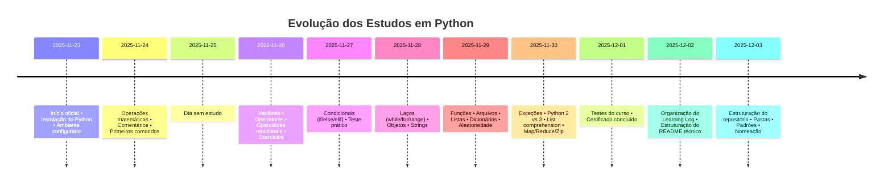

# 🐍 Python Learning Log — Registro de Estudos


---

## 📑 Sumário
- [Visão Geral](#-visão-geral)
- [Metodologia](#-metodologia)
- [Estrutura dos Exercícios](#-estrutura-dos-exercícios)
- [Progresso de Estudos](#-progresso-de-estudos)
- [Projetos Futuros](#-projetos-futuros)
- [Estrutura de Pastas (Sugerida)](#-estrutura-de-pastas-sugerida)

---

## 📘 Visão Geral

Este repositório consolida exercícios, anotações e experimentos desenvolvidos durante meu processo de aprendizado em **Python**.  

## 🚀 Objetivos

Seu objetivo é registrar minha evolução técnica e construir uma base sólida para aplicações em:

- **Data Science**
- **Engenharia de Dados**
- **Automação e Otimização de Processos**

---

## 🔎 Metodologia

Os exercícios seguem uma metodologia estruturada, alinhada ao fluxo lógico de resolução de problemas em programação:

1. **Definição do Problema** — formalização objetiva do que deve ser resolvido.  
2. **Especificação das Entradas** — identificação e tipagem das variáveis.  
3. **Processamento** — lógica, operações e transformações aplicadas aos dados.  
4. **Geração da Saída** — resultado final produzido pelo algoritmo.

---

## 📝 Estrutura dos Exercícios

Cada exercício contém:

- **Problema descrito com clareza**
- **Código bem comentado**
- **Demonstrações do resultado**
- **Explicação do raciocínio usado**

---

## 📈 Progresso de Estudos

| Data       | Conteúdo estudado                                                                                 | Status |
|------------|---------------------------------------------------------------------------------------------------|--------|
| 2025-11-23 | Início oficial dos estudos. Revisão básica sobre Python, instalação e ambiente.                   | ✔️ Concluído |
| 2025-11-24 | Operações matemáticas, comentários e primeiros comandos.                                          | ✔️ Concluído |
| 2025-11-25 |                                                                                                   | ⏸️ |
| 2025-11-26 | Variáveis, operadores e operadores relacionais. Primeiros exercícios práticos.                    | ✔️ Concluído |
| 2025-11-27 | Estruturas condicionais (`if`, `else`, `elif`) + Teste prático de condicionais.                    | ✔️ Concluído |
| 2025-11-28 | Estruturas de repetição (`while`, `for`, `range`), objetos e strings.                             | ✔️ Concluído |
| 2025-11-29 | Funções, arquivos, listas, dicionários e números aleatórios.                                      | ✔️ Concluído |
| 2025-11-30 | Tratamento de exceções, revisão Python 2 vs Python 3 e Python avançado (list comprehension, map, reduce, zip). | ✔️ Concluído |
| 2025-12-01 | Testes do curso e conclusão do certificado.                                                       | ✔️ Concluído |
| 2025-12-02 | Organização do *Python Learning Log* e estruturação do README técnico.                            | ✔️ Concluído |
| 2025-12-03 | Estruturação do repositório Python (pastas, padrões, naming conventions).                         | ✔️ Concluído |

---

## 🕰️ Linha do Tempo de Estudos (Nov–Dez/2025)



---
## 🚀 Projetos Futuros

- Automação com Python  
- Manipulação de dados com Pandas  
- Mini projetos para portfólio  
- Pipelines ETL/ELT  
- Projetos completos em Data Science  

---

## 📦 Estrutura de Pastas 

```
📦 python-learning-log
 ┣ 📁 basics
 ┃ ┣ 📜 variaveis.py
 ┃ ┣ 📜 condicoes.py
 ┃ ┣ 📜 funcoes.py
 ┣ 📁 desafios
 ┣ 📁 projetos
 ┣ 📁 anotacoes
 ┣ 📜 README.md
```

seu-repositorio/
├── README.md              # o que você já tem hoje
└── exercicios_livro_python/
    ├── pag_048_050/
    │   ├── ex_048_01.py ... ex_048_10.py
    │   ├── ex_049_01.py ... ex_049_10.py
    │   └── ex_050_01.py ... ex_050_10.py
    ├── pag_069_079/
    │   ├── ex_069_01.py ... ex_069_10.py
    │   ├── ex_070_01.py ... ex_070_10.py
    │   ├── ex_071_01.py ... ex_071_10.py
    │   ├── ex_072_01.py ... ex_072_10.py
    │   ├── ex_073_01.py ... ex_073_10.py
    │   ├── ex_074_01.py ... ex_074_10.py
    │   ├── ex_075_01.py ... ex_075_10.py
    │   ├── ex_076_01.py ... ex_076_10.py
    │   ├── ex_077_01.py ... ex_077_10.py
    │   ├── ex_078_01.py ... ex_078_10.py
    │   └── ex_079_01.py ... ex_079_10.py
    ├── pag_097_101/
    │   ├── ex_097_01.py ... ex_097_10.py
    │   ├── ex_098_01.py ... ex_098_10.py
    │   ├── ex_099_01.py ... ex_099_10.py
    │   ├── ex_100_01.py ... ex_100_10.py
    │   └── ex_101_01.py ... ex_101_10.py
    ├── pag_130_137/
    │   ├── ex_130_01.py ... ex_130_10.py
    │   ├── ex_131_01.py ... ex_131_10.py
    │   ├── ex_132_01.py ... ex_132_10.py
    │   ├── ex_133_01.py ... ex_133_10.py
    │   ├── ex_134_01.py ... ex_134_10.py
    │   ├── ex_135_01.py ... ex_135_10.py
    │   ├── ex_136_01.py ... ex_136_10.py
    │   └── ex_137_01.py ... ex_137_10.py
    ├── pag_151_157/
    │   ├── ex_151_01.py ... ex_151_10.py
    │   ├── ex_152_01.py ... ex_152_10.py
    │   ├── ex_153_01.py ... ex_153_10.py
    │   ├── ex_154_01.py ... ex_154_10.py
    │   ├── ex_155_01.py ... ex_155_10.py
    │   ├── ex_156_01.py ... ex_156_10.py
    │   └── ex_157_01.py ... ex_157_10.py
    ├── pag_165_171/
    │   ├── ex_165_01.py ... ex_165_10.py
    │   ├── ex_166_01.py ... ex_166_10.py
    │   ├── ex_167_01.py ... ex_167_10.py
    │   ├── ex_168_01.py ... ex_168_10.py
    │   ├── ex_169_01.py ... ex_169_10.py
    │   ├── ex_170_01.py ... ex_170_10.py
    │   └── ex_171_01.py ... ex_171_10.py
    └── pag_185_193/
        ├── ex_185_01.py ... ex_185_10.py
        ├── ex_186_01.py ... ex_186_10.py
        ├── ex_187_01.py ... ex_187_10.py
        ├── ex_188_01.py ... ex_188_10.py
        ├── ex_189_01.py ... ex_189_10.py
        ├── ex_190_01.py ... ex_190_10.py
        ├── ex_191_01.py ... ex_191_10.py
        ├── ex_192_01.py ... ex_192_10.py
        └── ex_193_01.py ... ex_193_10.py


---
